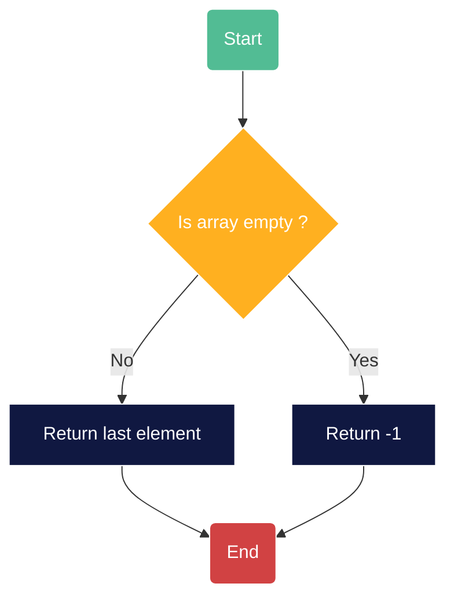

```mermaid
flowchart TD
    A(Start) --> B{Is array empty ?}
    B -- No --> C[Return last element]
    B -- Yes --> D[Return -1]
    C & D --> E(End)

    style A fill:#52bc94,stroke:#ffffff,stroke-width:1px,color: #ffffff
    style B fill:#ffb020,stroke:#ffffff,stroke-width:1px,color: #ffffff
    style C fill:#101841,stroke:#ffffff,stroke-width:1px,color: #ffffff
    style D fill:#101841,stroke:#ffffff,stroke-width:1px,color: #ffffff
    style E fill:#d14243,stroke:#ffffff,stroke-width:1px,color: #ffffff
```